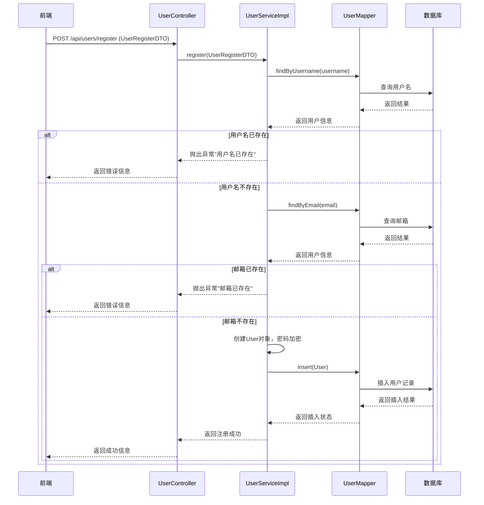
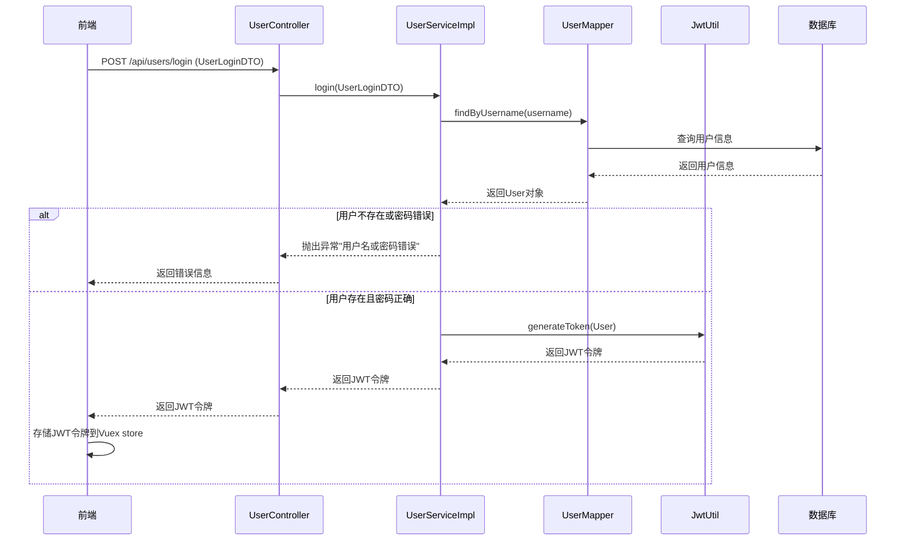
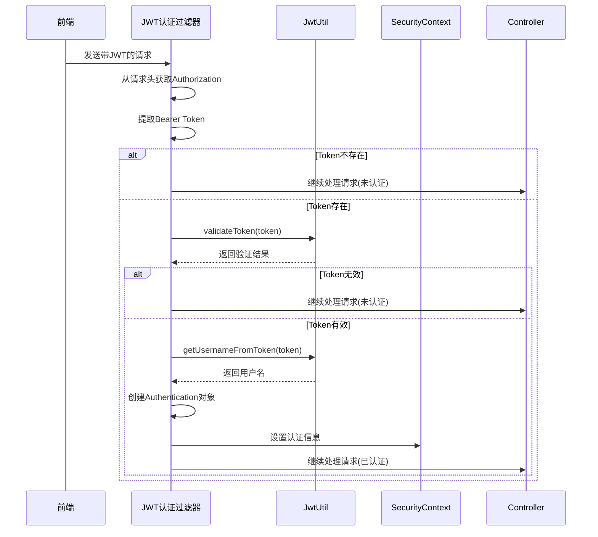
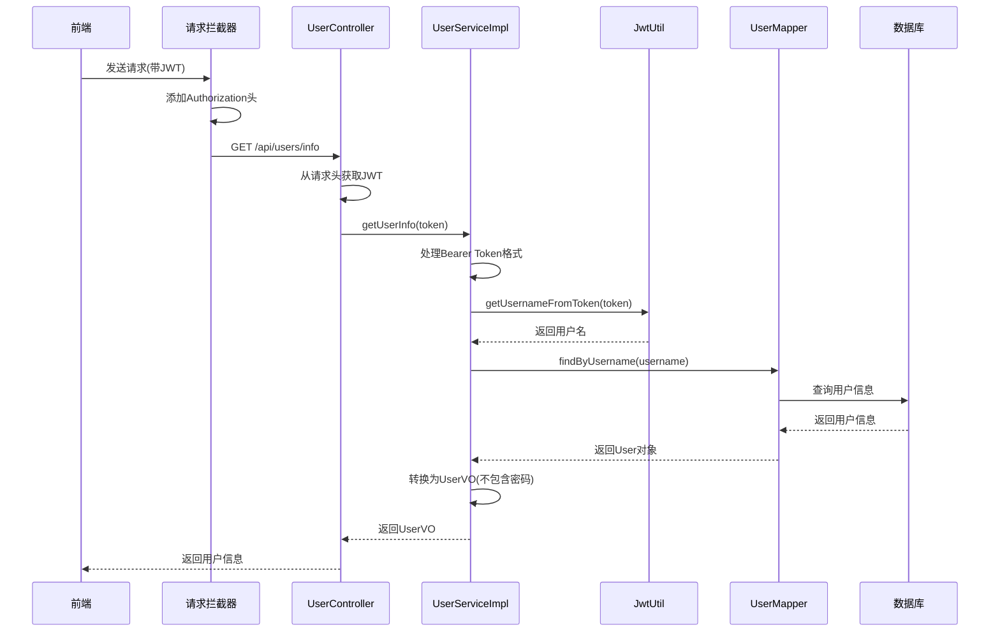

# Security+JWT传输文档

## 1. 概述

本文档详细描述了金融平台项目中Spring Security和JWT(JSON Web Token)的安全认证机制，以及各具体类在数据传输过程中的作用和流程。

## 2. 技术架构

### 2.1 安全认证技术栈
- **Spring Security**: 提供全面的安全服务框架
- **JWT (JSON Web Token)**: 用于无状态身份验证的令牌

- **BCryptPasswordEncoder**: 用于密码加密
- **Spring Boot**: 基础应用框架

### 2.2 核心组件
- [`SecurityConfig`](finance-dashboard/src/main/java/com/example/financedashboard/config/SecurityConfig.java): Spring Security配置类
- [`JwtUtil`](finance-dashboard/src/main/java/com/example/financedashboard/utils/JwtUtil.java): JWT工具类
- [`JwtAuthenticationFilter`](finance-dashboard/src/main/java/com/example/financedashboard/config/SecurityConfig.java:70): JWT认证过滤器
- [`UserController`](finance-dashboard/src/main/java/com/example/financedashboard/controller/UserController.java): 用户认证控制器
- [`UserServiceImpl`](finance-dashboard/src/main/java/com/example/financedashboard/service/impl/UserServiceImpl.java): 用户服务实现类

## 3. JWT配置

### 3.1 JWT配置参数
在[`application.yml`](finance-dashboard/src/main/resources/application.yml:19-21)中配置了JWT相关参数：

```yaml
jwt:
  secret: ${JWT_SECRET:financeDashboardJwtSecretKey2024ForTokenGenerationAndValidationThisIsASecureKeyWithEnoughLengthForHMACSHA256Algorithm}
  expiration: 604800 # 7天，单位秒
```

- **secret**: JWT签名密钥，用于生成和验证JWT令牌
- **expiration**: JWT过期时间，设置为7天(604800秒)

### 3.2 JWT令牌结构
JWT令牌由三部分组成：
1. **头部(Header)**: 包含令牌类型和签名算法
2. **载荷(Payload)**: 包含用户信息和声明
3. **签名(Signature)**: 用于验证令牌完整性

## 4. 数据传输对象

### 4.1 实体类(Entity)
- [`User`](finance-dashboard/src/main/java/com/example/financedashboard/entity/User.java): 用户实体类，包含用户的所有信息
- [`StockInfo`](finance-dashboard/src/main/java/com/example/financedashboard/entity/StockInfo.java): 股票信息实体类

### 4.2 数据传输对象(DTO)
- [`UserLoginDTO`](finance-dashboard/src/main/java/com/example/financedashboard/dto/UserLoginDTO.java): 用户登录数据传输对象
- [`UserRegisterDTO`](finance-dashboard/src/main/java/com/example/financedashboard/dto/UserRegisterDTO.java): 用户注册数据传输对象
- [`StockQueryDTO`](finance-dashboard/src/main/java/com/example/financedashboard/dto/StockQueryDTO.java): 股票查询数据传输对象

### 4.3 视图对象(VO)
- [`UserVO`](finance-dashboard/src/main/java/com/example/financedashboard/vo/UserVO.java): 用户信息视图对象，不包含敏感信息

### 4.4 统一响应对象
- [`Result<T>`](finance-dashboard/src/main/java/com/example/financedashboard/utils/Result.java): 统一API响应格式

## 5. 安全认证流程

### 5.1 用户注册流程



### 5.2 用户登录流程



### 5.3 JWT认证流程



### 5.4 获取用户信息流程



## 6. 前端安全实现

### 6.1 请求拦截器
在[`request.js`](finance-dashboard/frontend/src/utils/request.js:11-26)中实现了请求拦截器，自动添加JWT令牌到请求头：

```javascript
// 请求拦截器
service.interceptors.request.use(
    config => {
        const token = store.state.token
        if (token) {
            // 确保token格式为Bearer xxx
            const formattedToken = token.startsWith('Bearer ') ? token : `Bearer ${token}`
            config.headers['Authorization'] = formattedToken
        }
        return config
    },
    error => {
        console.log(error)
        return Promise.reject(error)
    }
)
```

### 6.2 响应拦截器
在[`request.js`](finance-dashboard/frontend/src/utils/request.js:28-46)中实现了响应拦截器，处理认证失败情况：

```javascript
// 响应拦截器
service.interceptors.response.use(
    response => {
        const res = response.data
        if (res.code !== 200) {
            // token过期或无效
            if (res.code === 401) {
                store.commit('clearUserInfo')
                router.push('/login')
            }
            return Promise.reject(new Error(res.message || 'Error'))
        } else {
            return res
        }
    },
    error => {
        console.log('err' + error)
        return Promise.reject(error)
    }
)
```

### 6.3 登录处理
在[`Login.vue`](finance-dashboard/frontend/src/views/Login.vue:56-75)中处理用户登录逻辑：

```javascript
const handleLogin = () => {
  loginFormRef.value.validate(valid => {
    if (valid) {
      loading.value = true
      login(loginForm)
          .then(response => {
            const { data } = response
            store.commit('setToken', data) // 存储JWT令牌
            ElMessage.success('登录成功')
            router.push('/')
          })
          .catch(error => {
            ElMessage.error(error.message || '登录失败')
          })
          .finally(() => {
            loading.value = false
          })
    }
  })
}
```

## 7. 安全配置详解

### 7.1 Spring Security配置
在[`SecurityConfig`](finance-dashboard/src/main/java/com/example/financedashboard/config/SecurityConfig.java:35-49)中配置了安全过滤器链：

```java
@Bean
public SecurityFilterChain filterChain(HttpSecurity http) throws Exception {
    http.csrf(csrf -> csrf.disable())
            .cors(cors -> cors.configurationSource(corsConfigurationSource()))
            .sessionManagement(session -> session.sessionCreationPolicy(SessionCreationPolicy.STATELESS))
            .authorizeHttpRequests(authz -> authz
                    .requestMatchers("/api/users/register", "/api/users/login").permitAll()
                    .requestMatchers("/error").permitAll() // 允许访问错误页面
                    .anyRequest().authenticated())
            .httpBasic(httpBasic -> httpBasic.disable()) // 禁用HTTP Basic认证
            .formLogin(formLogin -> formLogin.disable()) // 禁用表单登录
            .addFilterBefore(new JwtAuthenticationFilter(jwtUtil), UsernamePasswordAuthenticationFilter.class);

    return http.build();
}
```

### 7.2 CORS配置
在[`SecurityConfig`](finance-dashboard/src/main/java/com/example/financedashboard/config/SecurityConfig.java:51-62)中配置了跨域资源共享：

```java
@Bean
public CorsConfigurationSource corsConfigurationSource() {
    CorsConfiguration configuration = new CorsConfiguration();
    configuration.setAllowedOriginPatterns(Arrays.asList("*")); // 允许所有来源
    configuration.setAllowedMethods(Arrays.asList("GET", "POST", "PUT", "DELETE", "OPTIONS")); // 允许的方法
    configuration.setAllowedHeaders(Arrays.asList("*")); // 允许所有头部
    configuration.setAllowCredentials(true); // 允许携带凭证
    
    UrlBasedCorsConfigurationSource source = new UrlBasedCorsConfigurationSource();
    source.registerCorsConfiguration("/**", configuration);
    return source;
}
```

### 7.3 密码加密配置
在[`SecurityConfig`](finance-dashboard/src/main/java/com/example/financedashboard/config/SecurityConfig.java:64-67)中配置了密码加密器：

```java
@Bean
public BCryptPasswordEncoder passwordEncoder() {
    return new BCryptPasswordEncoder();
}
```

## 8. JWT工具类详解

### 8.1 JWT生成
在[`JwtUtil.generateToken()`](finance-dashboard/src/main/java/com/example/financedashboard/utils/JwtUtil.java:62-70)方法中生成JWT令牌：

```java
public String generateToken(User user) {
    // 构建JWT令牌
    return Jwts.builder()
            .subject(user.getUsername()) // 设置主题，通常是用户名
            .claim("userId", user.getId()) // 添加自定义声明，存储用户ID
            .expiration(new Date(System.currentTimeMillis() + expiration * 1000)) // 设置过期时间
            .signWith(getSigningKey()) // 设置签名密钥
            .compact(); // 生成令牌
}
```

### 8.2 JWT验证
在[`JwtUtil.validateToken()`](finance-dashboard/src/main/java/com/example/financedashboard/utils/JwtUtil.java:93-102)方法中验证JWT令牌：

```java
public boolean validateToken(String token) {
    try {
        // 解析JWT令牌，如果解析过程中没有抛出异常，则令牌有效
        Jwts.parser().verifyWith(getSigningKey()).build().parseSignedClaims(token);
        return true;
    } catch (Exception e) {
        // 如果解析过程中抛出异常，则令牌无效
        return false;
    }
}
```

### 8.3 密钥处理
在[`JwtUtil.getSigningKey()`](finance-dashboard/src/main/java/com/example/financedashboard/utils/JwtUtil.java:29-55)方法中处理签名密钥：

```java
private SecretKey getSigningKey() {
    // 使用Base64解码密钥，确保密钥长度足够
    byte[] keyBytes;
    try {
        // 尝试Base64解码
        keyBytes = Base64.getDecoder().decode(secret);
    } catch (IllegalArgumentException e) {
        // 如果不是Base64编码，直接使用字符串字节
        keyBytes = secret.getBytes();
    }
    
    // 确保密钥至少有256位（32字节）用于HS256算法
    if (keyBytes.length < 32) {
        // 如果密钥长度不足，使用SHA-256哈希扩展到32字节
        try {
            java.security.MessageDigest digest = java.security.MessageDigest.getInstance("SHA-256");
            keyBytes = digest.digest(secret.getBytes());
        } catch (java.security.NoSuchAlgorithmException ex) {
            // 如果SHA-256不可用，进行简单填充
            byte[] paddedKey = new byte[32];
            System.arraycopy(keyBytes, 0, paddedKey, 0, Math.min(keyBytes.length, 32));
            keyBytes = paddedKey;
        }
    }
    
    return Keys.hmacShaKeyFor(keyBytes);
}
```

## 9. 数据传输安全措施

### 9.1 密码安全
- 使用BCrypt算法对用户密码进行加密存储
- 密码在传输过程中使用HTTPS加密(生产环境)
- 前端表单验证确保密码强度

### 9.2 JWT安全
- JWT令牌使用强密钥签名
- JWT令牌设置合理的过期时间(7天)
- JWT令牌存储在前端内存中(非持久化存储)

### 9.3 API安全
- 使用Spring Security进行请求认证和授权
- 公开API(如登录、注册)不需要认证
- 受保护API需要有效的JWT令牌
- 统一异常处理，避免敏感信息泄露

## 10. 具体类的数据传输流程

### 10.1 用户认证相关类数据流程

#### 10.1.1 注册流程
1. **前端**: `Register.vue` → 收集用户注册信息
2. **DTO**: `UserRegisterDTO` → 封装注册数据
3. **Controller**: `UserController.register()` → 接收注册请求
4. **Service**: `UserServiceImpl.register()` → 处理注册逻辑
5. **Entity**: `User` → 创建用户实体，密码加密
6. **Mapper**: `UserMapper.insert()` → 插入数据库
7. **响应**: `Result<Boolean>` → 返回注册结果

#### 10.1.2 登录流程
1. **前端**: `Login.vue` → 收集用户登录信息
2. **DTO**: `UserLoginDTO` → 封装登录数据
3. **Controller**: `UserController.login()` → 接收登录请求
4. **Service**: `UserServiceImpl.login()` → 验证用户凭据
5. **JWT**: `JwtUtil.generateToken()` → 生成JWT令牌
6. **响应**: `Result<String>` → 返回JWT令牌

#### 10.1.3 获取用户信息流程
1. **前端**: `request.js` → 自动添加JWT令牌到请求头
2. **Filter**: `JwtAuthenticationFilter` → 验证JWT令牌
3. **Controller**: `UserController.getUserInfo()` → 接收请求
4. **Service**: `UserServiceImpl.getUserInfo()` → 从JWT获取用户名
5. **Entity**: `User` → 查询用户信息
6. **VO**: `UserVO` → 转换为视图对象(去除敏感信息)
7. **响应**: `Result<UserVO>` → 返回用户信息

### 10.2 股票数据相关类数据流程

#### 10.2.1 获取股票列表流程
1. **前端**: `StockList.vue` → 请求股票列表
2. **Filter**: `JwtAuthenticationFilter` → 验证JWT令牌
3. **Controller**: `StockController.getAllStockInfo()` → 接收请求
4. **Service**: `StockServiceImpl.getAllStockInfo()` → 处理业务逻辑
5. **Entity**: `StockInfo` → 查询股票信息
6. **响应**: `Result<List<StockInfo>>` → 返回股票列表

#### 10.2.2 查询股票详情流程
1. **前端**: `StockDetail.vue` → 请求股票详情
2. **Filter**: `JwtAuthenticationFilter` → 验证JWT令牌
3. **Controller**: `StockController.getStockByCode()` → 接收请求
4. **Service**: `StockServiceImpl.getStockByCode()` → 处理业务逻辑
5. **Entity**: `StockInfo` → 查询股票详情
6. **响应**: `Result<StockInfo>` → 返回股票详情

## 11. 异常处理

### 11.1 认证异常处理
- **用户名或密码错误**: 返回500状态码和错误消息
- **JWT令牌无效**: 返回401状态码，前端跳转到登录页
- **JWT令牌过期**: 返回401状态码，前端跳转到登录页
- **用户不存在**: 返回500状态码和错误消息

### 11.2 授权异常处理
- **访问未授权资源**: 返回403状态码
- **用户状态异常**: 返回500状态码和错误消息

### 11.3 全局异常处理
在[`GlobalExceptionHandler`](finance-dashboard/src/main/java/com/example/financedashboard/exception/GlobalExceptionHandler.java)中统一处理异常，确保不会泄露敏感信息。

## 12. 最佳实践和建议

### 12.1 安全最佳实践
1. **密码安全**: 使用强密码策略，定期提醒用户更换密码
2. **JWT安全**: 
   - 使用足够长的密钥(至少256位)
   - 设置合理的过期时间
   - 考虑实现JWT黑名单机制
3. **传输安全**: 生产环境必须使用HTTPS
4. **日志安全**: 避免在日志中记录敏感信息

### 12.2 性能优化建议
1. **JWT缓存**: 可以考虑对JWT验证结果进行短期缓存
2. **数据库优化**: 为用户表的用户名和邮箱字段添加索引
3. **前端优化**: 合理设置JWT令牌的刷新机制

### 12.3 扩展建议
1. **多因素认证**: 可以考虑添加短信或邮箱验证
2. **角色权限**: 扩展基于角色的访问控制(RBAC)
3. **JWT刷新**: 实现JWT令牌刷新机制
4. **审计日志**: 添加用户操作审计日志

## 13. 总结

本文档详细描述了金融平台项目中Spring Security和JWT的安全认证机制，以及各具体类在数据传输过程中的作用和流程。通过JWT实现无状态认证，提高了系统的可扩展性和性能。同时，通过Spring Security提供了全面的安全保护，确保了系统的安全性。

在实际应用中，还需要根据具体业务需求进行调整和扩展，持续关注安全漏洞和最佳实践，确保系统的安全性和稳定性。